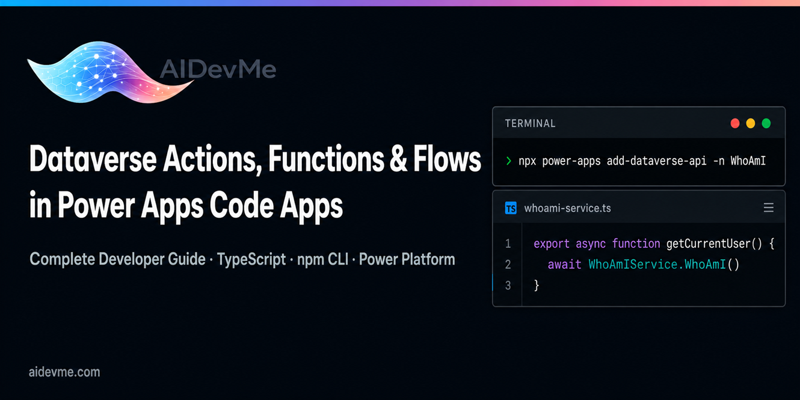

# 🚀 Power Apps Code Apps Samples



Community samples for Power Apps Code Apps built with React, TypeScript, and the Power Platform CLI. Covers Dataverse integration, connectors, ALM, and pro-code patterns. Curated for Power Platform architects and senior developers.

## Overview

This repository contains community-contributed samples demonstrating how to build Power Apps Code Apps using modern web technologies and Power Platform tooling. Each sample is designed to highlight specific capabilities, patterns, or integrations relevant to enterprise-grade Power Platform development.

## Topics Covered

- **React & TypeScript** — Component-based UI development with type safety
- **Power Platform CLI** — Scaffolding, building, and deploying Code Apps via `pac`
- **Dataverse Integration** — Working with tables, relationships, and the Web API
- **Connectors** — Custom and standard connector usage within Code Apps
- **ALM (Application Lifecycle Management)** — Solutions, pipelines, and environment strategies
- **Pro-Code Patterns** — Reusable patterns for scalable, maintainable Code Apps

## Prerequisites

- [Node.js](https://nodejs.org/) (LTS recommended)
- [Power Platform CLI (`pac`)](https://aka.ms/PowerAppsCLI)
- A Power Platform environment with a Dataverse database
- Visual Studio Code with the [Power Platform Tools extension](https://marketplace.visualstudio.com/items?itemName=microsoft-IsvExpTools.powerplatform-vscode)

## Getting Started

1. Clone the repository:
   ```bash
   git clone https://github.com/aidevme/power-apps-code-apps-samples.git
   cd power-apps-code-apps-samples
   ```

2. Navigate to a sample folder and follow its individual `README.md` for setup instructions.

3. Authenticate with the Power Platform CLI:
   ```bash
   pac auth create --url https://<your-environment>.crm.dynamics.com
   ```

4. Install dependencies and start the local development server:
   ```bash
   npm install
   npm start
   ```

## Repository Structure

```
power-apps-code-apps-samples/
├── samples/
│   └── <sample-name>/          # Individual sample folders
│       ├── src/                # React/TypeScript source code
│       ├── public/
│       ├── package.json
│       └── README.md           # Sample-specific documentation
└── README.md
```
## Samples

| Sample | Description |
|---|---|
| [Basic Sample](src/basic-sample/) | Minimal Code App scaffolded from the official Vite template. Covers `pac code init`, local HMR dev, and `pac code push` deployment. · [Docs](src/basic-sample/docs/index.md) |
| [Dataverse Actions, Functions & Power Automate Flows](src/dataverse-actions-functions-power-automate-flows-samples/) | Demonstrates calling unbound Dataverse Custom API Actions (POST), Custom API Functions (GET with OData parameters), and triggering Power Automate instant flows via HTTP Request triggers. · [Docs](src/dataverse-actions-functions-power-automate-flows-samples/docs/index.md) |
| [IFrame Samples](src/iframe-samples/) | Shows how to embed external web content inside a Power Apps Code App using iframes, including communication patterns between the host app and embedded pages. · [Docs](src/iframe-samples/docs/index.md) |
| [Localization Samples](src/localization-samples/) | Demonstrates multi-language support in a Code App using Power Apps locale context, dynamic string resources, and LCID-driven UI rendering. · [Docs](src/localization-samples/docs/index.md) |
| [Metadata Samples](src/metadata-samples/) | Shows how to retrieve Dataverse table metadata at runtime using `getMetadata` on generated service classes — covering entity definitions, attribute metadata, and relationships with localized labels. · [Docs](src/metadata-samples/docs/index.md) |

## Contributing

Contributions are welcome! To submit a sample:

1. Fork the repository
2. Create a new folder under `samples/` following the existing structure
3. Include a `README.md` describing the sample, prerequisites, and setup steps
4. Open a pull request with a clear description of the sample and the patterns it demonstrates

Please ensure your sample compiles without errors and follows the coding conventions used across the repository.

## Resources

- [Power Apps Code Apps documentation](https://learn.microsoft.com/power-apps/developer/component-framework/code-components-overview)
- [Power Platform CLI reference](https://learn.microsoft.com/power-platform/developer/cli/introduction)
- [Dataverse Web API](https://learn.microsoft.com/power-apps/developer/data-platform/webapi/overview)
- [Power Platform ALM guide](https://learn.microsoft.com/power-platform/alm/)

## License

This repository is licensed under the [MIT License](LICENSE).
